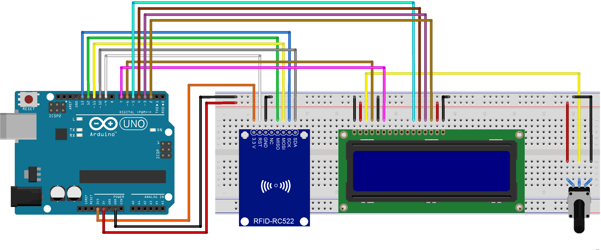

# Mackenzie-projeto-catraca2
## [Circuitos eletricos e eletronicos] 1* sem. 2018
## Turma 1G12
## Projeto: "Leitor RFID com lcd"
## Integrantes do grupo:
## Thiago Kenji Ohphata / TIA:31830625
## - Conceito:
## Tag e leitor RFID (Radio Frequency Identification, ou Identificação por Radiofrequência) costumam ser utilizados para controle de acesso e identificação de pessoas e equipamentos, seja por meio de crachás ou etiquetas aplicadas à produtos. No nosso dia-a-dia, podemos encontrar a tecnologia RFID nos pedágios (no popular “Sem Parar”), ou em cartões tipo Bilhete Único, utilizados em várias cidades brasileiras para acesso ao transporte coletivo
## - Materiais utilizados:
## Potenciômetro
## Arduino/ Genuino Uno
## Display 16x2
## Leitor RFID
## Cartao de ID
## Chaveiro ID
## Jumpers macho-macho
## - Conexões do RFID:
## Pino DAS ligado na porta 10 do Arduino
## Pino SCK ligado na porta 13 do Arduino
## Pino MOSI ligado na porta 11 do Arduino
## Pino MISO ligado na porta 12 do Arduino
## Pino NC não conectado
## Pino GND ligado no pino GND do Arduino
## Pino RST ligado na porta 9 do Arduino
## Pino 3.3 ligado no pino 3.3 V do Arduino

## - Programando no Arduino:
## Uma das chaves pra rodar o Sketch (que vai estar neste documento) e a instalação da biblioteca MFRC522

